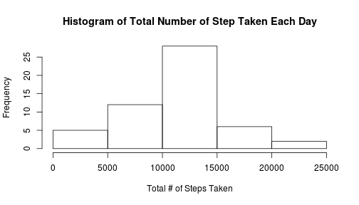
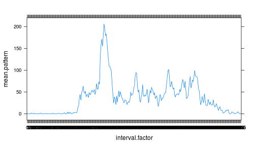
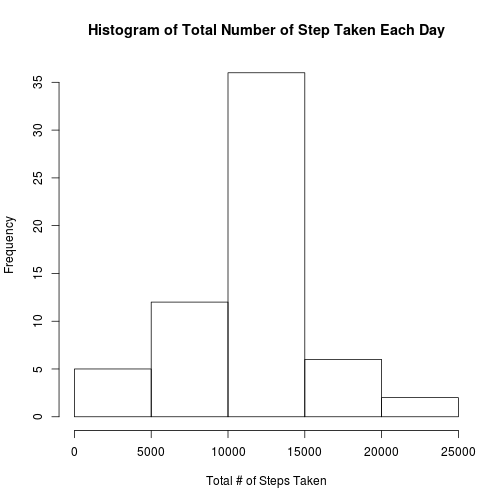
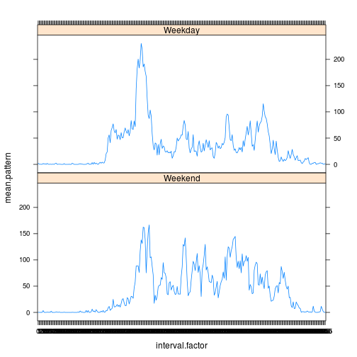

```r
activity <- read.csv("activity.csv")
```
## What is mean total number of steps taken per day?
Calculate the total number of steps taken per day

```r
library(plyr)
activity.summary <- ddply(activity, ~ date,
                        summarize, total.steps=sum(steps))
```
Make a *histogram* of the total number of steps taken each day

```r
hist(activity.summary$total.steps,main = paste("Histogram of Total Number of Step Taken Each Day"),xlab = paste("Total # of Steps Taken"))
```

 


Calculate and report the mean and median of the total number of steps taken per day:

```r
activity.mean   <- mean(activity.summary$total.steps,na.rm=TRUE)
activity.median <- median(activity.summary$total.steps,na.rm=TRUE)
```
For the total number of steps taken per day, the mean is 1.0766189 &times; 10<sup>4</sup> and the
median is 10765.

## What is the average daily activity pattern?
1. Make a time series plot (i.e. type = "l") of the 5-minute interval (x-axis) and the average number of steps taken, averaged across all days (y-axis)


```r
activity$interval.factor <- as.factor(activity$interval)
activity.CC <- activity[complete.cases(activity),]
activity.orderedInterval <- activity.CC[with(activity.CC,order(interval.factor)), ]
activity.pattern <- ddply(activity.orderedInterval, ~ interval.factor,
                        summarize, mean.pattern=mean(steps))
library(lattice)
xyplot(mean.pattern~interval.factor,data=activity.pattern,type='l')
```

 

2. Which 5-minute interval, on average across all the days in the dataset, contains the maximum number of steps?

```r
max.steps.row <- activity.pattern[which.max(activity.pattern$mean.pattern), ]
max.steps.interval <- as.character(max.steps.row$interval.factor)
```
   The interval factor containing the maximum number of average steps is 
835.

## Imputing missing values
1. Calculate and report the total number of missing values in the dataset (i.e. the total number of rows with NAs):

```r
missingValues <- nrow(activity) - nrow(activity.CC)
```
The number of rows with one or more missing values is 2304.


2. Devise a strategy for filling in all of the missing values in the dataset. The strategy does not need to be sophisticated. For example, you could use the mean/median for that day, or the mean for that 5-minute interval, etc.

*The strategy used is to fill missing values with the mean for that 5-minute interval.*

3. Create a new dataset that is equal to the original dataset but with the missing data filled in.

```r
activity.incomplete <- activity[!complete.cases(activity), ]
activity.incomplete$idx.of.data <- match(activity.incomplete$interval.factor,activity.pattern$interval.factor)
activity.incomplete$newval <- activity.pattern[(activity.incomplete$idx.of.data),2]
activity.complete <- activity[complete.cases(activity), ]
activity.new.incomplete <- data.frame(activity.incomplete$newval,activity.incomplete[,2],activity.incomplete[,3],activity.incomplete[,4])
colnames(activity.new.incomplete) <- colnames(activity.complete)
activity.new <- rbind(activity.new.incomplete,activity.complete)
activity.new.sorted <- activity.new[with(activity.new,order(date,interval)), ]
```
4. Make a histogram of the total number of steps taken each day and calculate and report the mean and median total number of steps taken per day. Do these values differ from the estimates from the first part of the assignment? What is the impact of imputing missing data on the estimates of the total daily number of steps?


```r
activity.new.summary <- ddply(activity.new.sorted, ~ date,
                        summarize, total.steps=sum(steps))
hist(activity.new.summary$total.steps,main = paste("Histogram of Total Number of Step Taken Each Day"),xlab = paste("Total # of Steps Taken"))
```

 

```r
activity.new.mean   <- mean(activity.new.summary$total.steps)
activity.new.median <- median(activity.new.summary$total.steps)
```
For the total number of steps taken per day, the mean is 1.0766189 &times; 10<sup>4</sup> and the
median is 1.0766189 &times; 10<sup>4</sup>.

The impact of imputting missing data on the estimates of the total daily number of steps is that the frequency reported between 10,000 and 15,000 steps increased by nearly 40%.

##Are there differences in activity patterns between weekdays and weekends?

1.Create a new factor variable in the dataset with two levels – “weekday” and “weekend” indicating whether a given date is a weekday or weekend day.

*In the new factor variable "Weekend" indicates weekend and "Weekday"" indicates week days.*


```r
MyWeekend <- function(mydate){
    mydate.as.Date <- as.Date(mydate, format="%Y-%m-%d")
    if ((weekdays(mydate.as.Date)=="Saturday") || (weekdays(mydate.as.Date)=="Sunday"))
        return("E")
    else 
        return("D")
    }
activity.new.sorted$weekdays <- as.factor(sapply(activity.new.sorted$date,MyWeekend))
activity.new.orderedInterval <- activity.new.sorted[with(activity.new.sorted,
                                                 order(weekdays,interval.factor)), ]
activity.new.orderedInterval.WE <- activity.new.orderedInterval[activity.new.orderedInterval$weekdays=="E", ]
activity.new.orderedInterval.WD <- activity.new.orderedInterval[activity.new.orderedInterval$weekdays=="D", ]
activity.new.pattern.weekend <- ddply(activity.new.orderedInterval.WE, 
                                      ~ interval.factor,summarize, 
                                      mean.pattern=mean(steps))
activity.new.pattern.weekend$day <- as.factor("Weekend")
activity.new.pattern.weekday <- ddply(activity.new.orderedInterval.WD, 
                                      ~ interval.factor,summarize, 
                                      mean.pattern=mean(steps))
activity.new.pattern.weekday$day <- as.factor("Weekday")
activity.new.pattern.all <- rbind(activity.new.pattern.weekend,activity.new.pattern.weekday)
```
2. Make a panel plot containing a time series plot (i.e. type = "l") of the 5-minute interval (x-axis) and the average number of steps taken, averaged across all weekday days or weekend days (y-axis). See the README file in the GitHub repository to see an example of what this plot should look like using simulated data.

```r
library(lattice) 
xyplot(mean.pattern~interval.factor|day,data=activity.new.pattern.all,type='l',layout=c(1,2))
```

 
